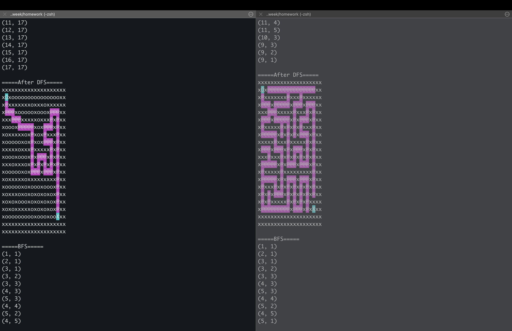

# 사용법
**`make` 필요함.**
```bash
make # 기본 옵션으로 빌드.

./solve_maze # 미로 데이터 입력해야 함.
# 또는 data/input 디렉터리에 있는 미로 파일 활용할 수 있음.
./solve_maze < data/input/maze_#x#.txt

make clean # object file 지움.
make fclean # object file 및 실행파일 지움.
make re # make fclean -> make
```

**입력 데이터는 아래 양식을 지켜야 함.**
> 양식을 지키지 않아도 오류 체크는 하지 않음. 그러나 오동작을 일으킬 수 있음.
- 최상단에 `n` `m` 입력.
- 바로 다음 줄부터 n x m 미로 입력.
- 사용 가능 문자는 다음과 같음.
  - 시작지점: `O`
  - 벽: `x`
  - 길: `o`
  - 도착 지점 `X`

예시:
```
7 7
Ooooooo
xxxxxxo
ooooooo
oxxxxxx
oooxooo
xxoxoxo
oooooxX
```

## 변경 가능한 옵션
**탐색 방향 순서**
- 기본 옵션: UP, DOWN, LEFT, RIGHT (왼쪽부터)

**옵션은 아래 양식을 지켜야 함.**
```bash
make DIRECTION='"{ UP, DOWN, LEFT, RIGHT }"'
```
  - 중괄호 내부 요소들의 순서 변경하여 탐색 방향 변경 가능함.

## 기타
- 제어문자를 사용해서 탐색 경로를 magenta 색상으로 표시함. 미로의 입구 및 출구는 cyan 색상으로 표시함.
  - 터미널에 결과를 출력하면 예쁘게 감상할 수 있음.

## 결과 예시
- 20x20 미로. 출구가 있는 경우와 없는 경우를 비교해봄. 탐색 순서는 기본 옵션(상하좌우 순).
- 출구가 없는 미로는 도착 지점이 사방으로 고립되었다는 점 외에는 출구가 있는 미로와 구성이 같음.

